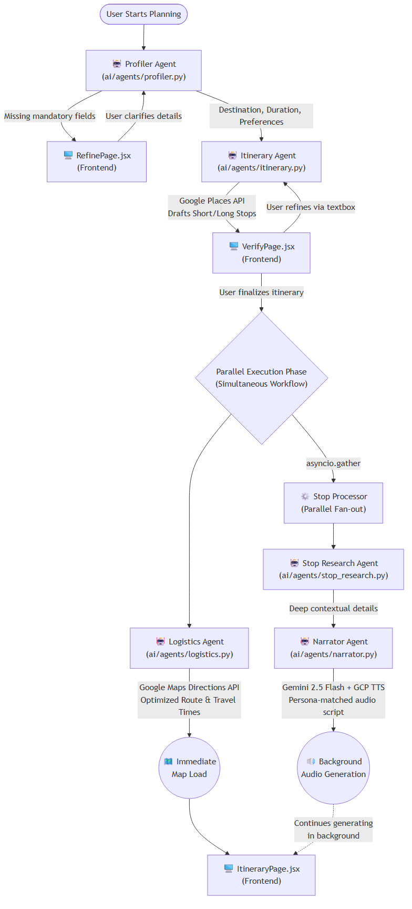

# Wandr

**AI-powered personalized travel guide with audio narration**

_Built for the Kaggle AI Agents Capstone | Concierge Agents Track_

🚀 **Live Application**: [wandr-teamasquared.vercel.app](https://wandr-teamasquared.vercel.app)

## 📖 Overview

**Wandr** is a multi-agent travel guide designed to act as a concierge in your pocket. It replaces tedious research and generic routing with a customized itinerary tailored to a specific persona (e.g., foodie, historian, adventurer). Wandr goes beyond standard routing by generating a unique, persona-matched audio narration for each stop, transforming a regular walk into an immersive tour.

## ⚠️ The Problem

Trip planning today is fragmented and impersonal. Travelers waste hours combining basic maps, generic blogs, and standard reviews to build an itinerary. Furthermore, even once a route is planned, traditional apps lack the contextual storytelling and on-the-ground atmosphere that a human tour guide provides. This leaves travelers with an overwhelming amount of raw data and logistics, but no real connection to the culture or vibe of their destinations.

## 💡 The Solution

Wandr acts as your personal concierge by bridging the gap between logistics and storytelling.
Using a 6-agent pipeline built on Google ADK, Wandr ingests your trip preferences, researches optimal stops, and builds a customized itinerary. Once you finalize your trip, it concurrently optimizes your route and generates a custom-tailored audio narration for every location. You don't just get a map of where to go; you get an interactive, streaming audio guide that highlights hidden gems, local tips, and relevant facts in a tone that matches your personal travel style.

---

## 🚀 How to Setup and Run Locally

### Prerequisites

- Python (v3.12 is required for Google ADK and `asyncio` task handling)
- Node.js (v20.19.0+)
- Google Cloud account with access to Secret Manager and Cloud Storage
- A Google Cloud API Key (with access to Places, Maps Directions, and Cloud TTS)
- A Google Gemini API Key

### 1. Clone & Install

```bash
git clone https://github.com/your-username/wandr.git
cd wandr
```

### 2. Environment Variables

No secrets are committed to the repository. The backend uses `pydantic-settings` to load from a `.env` file or Google Cloud Secret Manager. Create a `.env` inside the `ai/` directory:

```env
# ai/.env
GEMINI_API_KEY=your_gemini_api_key
GOOGLE_CLOUD_API_KEY=your_google_cloud_api_key
# (Optional) Specific keys if different from the Cloud API key:
# GOOGLE_PLACES_API_KEY=your_places_key
# GOOGLE_ROUTES_API_KEY=your_routes_key
# GOOGLE_TTS_API_KEY=your_tts_key
GCS_BUCKET_NAME=your_gcs_bucket_name
MODEL_NAME=gemini-2.5-flash
```

### 3. Run the Backend API

The backend requires Python 3.12. We recommend using a virtual environment.

```bash
cd ai
python -m venv venv
# On Windows: venv\Scripts\activate
# On Mac/Linux: source venv/bin/activate
pip install .

uvicorn api.server:app --host 0.0.0.0 --port 8080
```

### 4. Run the Frontend Development Server

In a new terminal window:

```bash
cd frontend
npm install
# Ensure you point to your local backend API if needed
npm run dev
```

Navigate to `http://localhost:5173` (or the port Vite provides) to start planning your trip!

---

## ✨ Key Features

- **Multi-Agent Pipeline**: 6 specialized agents powered by Google ADK (Profiler, Itinerary, Stop Research, Narrator, Logistics, and Orchestrator).
- **Persona-Driven Personalization**: Every trip adapts to one of five personas (foodie, artist, historian, adventurer, local-life), adjusting the pace, budget, and audio tone.
- **Audio Narration Engine**: Dynamically generates 60–90s contextual audio scripts using Gemini 2.5 Flash and Google Cloud TTS.
- **Parallel Fan-out Execution**: Heavy narration and stop research tasks run concurrently via `asyncio.gather` so the map route loads instantly while audio streams in the background.
- **Real-time SSE Streaming**: FastAPI streams pipeline progress via Server-Sent Events directly to the React frontend, populating the UI incrementally as agents finish their work.
- **Strict Data Contracts**: All inter-agent communication is strictly typed using Pydantic models.

## 🛠️ Architecture

### System Flow



```text
User prompt
    ↓
Profiler ──────────────────────────── writes: session.state["persona"] (requires destination, duration, travel preference)
    │                                  └─ If missing: Asks clarifying questions on RefinePage.jsx
    ↓
Itinerary ─────────────────────────── reads: persona
                                       writes: session.state["itinerary_options"] (listed on VerifyPage.jsx)
                                       └─ Refinement textbox on VerifyPage.jsx gets Itinerary to regenerate
    ↓
VerifyPage finalize ───────────────── writes: session.state["itinerary"]
    ↓
Parallel Execution (Run Concurrently)
    ├── Logistics Agent ───────────── reads: finalized itinerary selection
    │                                  writes: session.state["route"] (triggers logistics_done)
    │                                  └─ Immediately loads ItineraryPage.jsx to draw map once done
    │
    └── Stop Processor fan-out ────── writes: session.state["audio_scripts"] (triggers stop_done)
         ├── Stop A: StopResearch → Narrator ─┐  (Narration/audio streams in whenever ready)
         ├── Stop B: StopResearch → Narrator ─┤── asyncio.gather()
         └── Stop N: StopResearch → Narrator ─┘
```

### Technology Stack

- **Frontend**: React, Tailwind CSS, Vite, `@vis.gl/react-google-maps`.
- **Backend**: FastAPI, Uvicorn, Python 3.12 (Google ADK).
- **AI Models**: Gemini 2.5 Flash via Google ADK (`LlmAgent`, `SequentialAgent`).
- **External Tools**: Google Places API, Google Maps Directions API, Google Cloud TTS, Google Cloud Storage.
- **Realtime Comm**: Server-Sent Events (SSE) with `X-Accel-Buffering: no` for Cloud Run compatibility.

## 🔐 Security Features

- **Local Persona Storage**: User preferences are stored in browser `localStorage` and are never sent to external APIs as PII.
- **No PII to APIs**: Only destination strings and place IDs are routed to Google Places.
- **Secret Management**: Native integration with Google Cloud Secret Manager for robust production deployments.
- **Signed URLs**: Generated audio URLs from Cloud Storage are signed and automatically expire to protect assets.

---

## 🔮 Future Improvements

While Wandr currently provides a fully functional local-first planning experience, we have several features planned for the future:

- **Importing & Sharing Trips**: The ability to export a planned itinerary and share it with friends via a unique link.
- **User Accounts & Cloud Storage**: A robust authentication system to allow users to save their trips to an account, access them across multiple devices, and resume planning anywhere. (Currently, trips are not persistently saved to a personal account in the deployed version).

---

## 👥 The Team

- **Angela Kwok** - [github.com/angelatyk](https://github.com/angelatyk)
- **Andres Linero** - [github.com/andres-linero](https://github.com/andres-linero)
